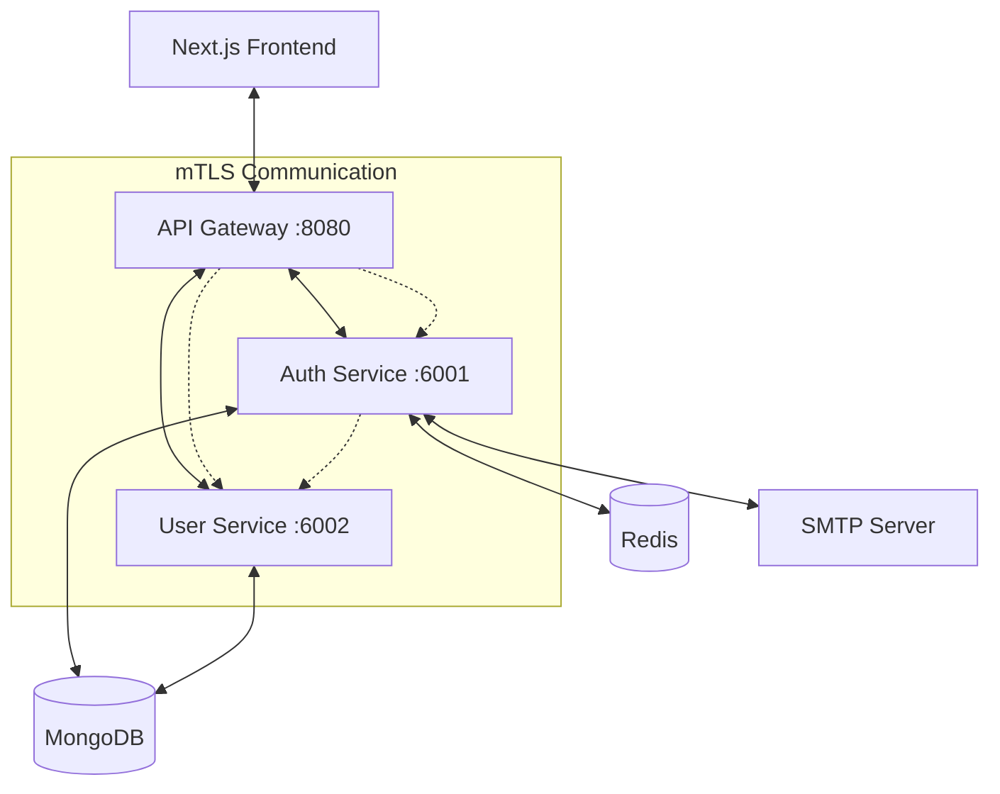

# TecShop

A modern, secure, and scalable e-commerce platform built with microservices architecture. TecShop demonstrates enterprise-grade patterns including mutual TLS authentication, comprehensive security measures, and advanced user management features.

## Overview & DEMO

TecShop is a production-ready microservices-based e-commerce platform that showcases modern software architecture principles. The system implements a secure, scalable foundation suitable for enterprise applications with features like JWT authentication, refresh token rotation, social login, and comprehensive user management.

I will add a video demo link later.

## Kanban Project Management methology

I will add Pictures of my agil methologies later

## Architecture

### Microservices Design

- **API Gateway** (Port 8080): Central entry point with rate limiting, authentication, and request routing
- **Auth Service** (Port 6001): Handles authentication, authorization, and security operations
- **User Service** (Port 6002): Manages user profiles, social features, and user-related data
- **Frontend Application**: Modern Next.js client with React 19 and server-side rendering

### Security Features

- **Mutual TLS (mTLS)**: Secure service-to-service communication with certificate-based authentication
- **JWT Authentication**: Stateless authentication with access and refresh token rotation
- **Rate Limiting**: Configurable throttling to prevent abuse and ensure stability
- **CSRF Protection**: Cross-site request forgery prevention
- **Security Headers**: Comprehensive HTTP security headers via Helmet
- **Input Validation**: Robust validation using class-validator and DTOs
- **Password Security**: bcrypt hashing with configurable salt rounds

## Technology Stack

### Backend

- **Framework**: NestJS with TypeScript
- **Database**: MongoDB with Prisma ORM
- **Caching**: Redis for session management and rate limiting
- **Authentication**: JWT with Passport strategies
- **Communication**: TCP microservices with RxJS
- **Logging**: Structured logging with Pino
- **Documentation**: Swagger/OpenAPI integration

### Frontend

- **Framework**: Next.js 15 with React 19
- **Styling**: Tailwind CSS with component variants
- **State Management**: TanStack Query for server state
- **Forms**: TanStack Form with validation
- **UI Components**: Radix UI primitives
- **Notifications**: Sonner for toast messages

### DevOps & Tooling

- **Monorepo**: Nx workspace with project orchestration
- **Testing**: Jest with comprehensive test suites
- **Linting**: ESLint with TypeScript integration
- **Package Management**: npm workspaces

## Key Features

### Authentication & Security

- Email/password registration with OTP verification
- Google OAuth 2.0 integration
- Remember me functionality with extended sessions
- Password reset with secure 6-digit codes
- Automatic token refresh with rotation
- Session management with httpOnly cookies

### User Management

- Comprehensive user profiles with bio and images
- Follow/unfollow social functionality
- Image upload and management system
- User preferences and settings

### Developer Experience

- Hot reload for all services
- Comprehensive error handling
- Structured logging across services
- API documentation with Swagger
- Type-safe communication between services

## Quick Start

### Prerequisites

- Node.js 18+
- MongoDB database
- Redis instance
- SMTP server (for email functionality)

### Installation

1. Clone the repository

```bash
git clone <repository-url>
cd tec-shop
```

2. Install dependencies

```bash
npm install
```

3. Set up environment variables

```bash
cp .env.example .env
# Edit .env with your configuration
```

4. Generate Prisma clients

```bash
npm run prisma:generate
```

5. Push database schema

```bash
npm run prisma:db-push
```

6. Generate mTLS certificates (optional for development)

```bash
./generate-certs.sh --all
```

7. Start all services

```bash
npm run dev
```

The application will be available at:

- API Gateway: http://localhost:8080/api
- API Documentation: http://localhost:8080/api-docs
- Frontend: http://localhost:3000

## Development Commands

### Service Management

```bash
npm run dev              # Start all services
npm run user-ui          # Start only frontend
npx nx serve <service>   # Start specific service
npx nx build <service>   # Build specific service
```

### Database Operations

```bash
npm run prisma:generate  # Generate Prisma client
npm run prisma:db-push   # Push schema changes
npm run prisma:studio    # Open Prisma Studio
```

### Certificate Management

```bash
./generate-certs.sh --all        # Generate all certificates
./generate-certs.sh --service auth-service  # Generate for specific service
./generate-certs.sh --clean      # Remove all certificates
```

### Testing & Quality

```bash
npx nx test <service>         # Run tests for service
npx nx lint <service>         # Lint specific service
npx nx typecheck <service>    # Type check service
npx nx run-many --target=test --all  # Run all tests
```

## Environment Variables

### Required Variables

```bash
# Database Configuration
AUTH_SERVICE_DB_URL="mongodb://localhost:27017/auth"
USER_SERVICE_DB_URL="mongodb://localhost:27017/user"

# Redis Configuration
REDIS_URL="redis://localhost:6379"

# Security
JWT_SECRET="your-jwt-secret-minimum-32-characters"

# Email Configuration
SMTP_HOST="smtp.example.com"
SMTP_PORT=587
SMTP_USER="your-smtp-user"
SMTP_PASS="your-smtp-password"
SMTP_FROM="noreply@yourdomain.com"

# Google OAuth (optional)
GOOGLE_CLIENT_ID="your-google-client-id"
GOOGLE_CLIENT_SECRET="your-google-client-secret"
GOOGLE_CALLBACK_URL="http://localhost:8080/api/auth/google/callback"

# Service Configuration
AUTH_SERVICE_HOST=localhost
AUTH_SERVICE_PORT=6001
USER_SERVICE_HOST=localhost
USER_SERVICE_PORT=6002
```

### Production Configuration

For production deployment, use the `.env.production.example` template with:

- Strong, unique secrets for JWT and encryption
- Production database URLs with connection pooling
- Production SMTP credentials
- Secure Redis configuration
- HTTPS URLs for all external services

## API Documentation

The API is fully documented with Swagger/OpenAPI. Access the interactive documentation at:

- Development: http://localhost:8080/api-docs
- Production: https://your-domain.com/api-docs

### Authentication Endpoints

| Method | Endpoint                    | Description              |
| ------ | --------------------------- | ------------------------ |
| POST   | `/api/auth/signup`          | Register new user        |
| POST   | `/api/auth/verify-email`    | Verify email with OTP    |
| POST   | `/api/auth/login`           | Authenticate user        |
| POST   | `/api/auth/refresh`         | Refresh access token     |
| POST   | `/api/auth/logout`          | Logout user              |
| POST   | `/api/auth/forgot-password` | Request password reset   |
| POST   | `/api/auth/reset-password`  | Reset password with code |
| GET    | `/api/auth/google`          | Google OAuth login       |

### User Management Endpoints

| Method | Endpoint    | Description              |
| ------ | ----------- | ------------------------ |
| GET    | `/api/user` | Get current user profile |
| PATCH  | `/api/user` | Update user profile      |

of course this is only the initial setup of endpoints, I will add more as I develop, the project is in the baby stage anyways.

## Architecture Diagram



## Security Considerations

### Authentication Flow

1. User registers with email/password
2. OTP sent via email for verification
3. Email verification creates user profile
4. JWT access token (1-24 hours) and refresh token (7-30 days) issued
5. Tokens stored in httpOnly cookies
6. Automatic token refresh with rotation
7. Secure logout with token revocation

### Rate Limiting

- Login attempts: 5 per 15 minutes
- Registration: 3 per 15 minutes
- Password reset: 3 per 15 minutes
- Token refresh: 10 per 15 minutes

### Data Protection

- Passwords hashed with bcrypt (10 rounds)
- Refresh tokens hashed with SHA-256
- Sensitive data encrypted in transit (HTTPS/TLS)
- Input validation on all endpoints
- SQL injection prevention via Prisma ORM

## Deployment

### Docker Deployment

The project includes Docker configurations for containerized deployment:

```bash
# Build and run with Docker Compose
docker-compose up -d
```

### Production Checklist

- [ ] Use strong, unique environment variables
- [ ] Configure production databases with connection pooling
- [ ] Set up Redis with persistence and clustering
- [ ] Configure HTTPS with valid SSL certificates
- [ ] Enable request logging and monitoring
- [ ] Set up health checks and graceful shutdown
- [ ] Configure reverse proxy (nginx/Apache)
- [ ] Enable database backups
- [ ] Set up monitoring and alerting

## Performance Features

### Database Optimization

- Indexed queries for optimal performance
- Separate databases per service
- Connection pooling with Prisma
- Optimistic concurrency control

### Caching Strategy

- Redis for session storage
- Rate limiting data caching
- OTP and reset code caching
- Connection pooling

### Security Performance

- JWT stateless authentication
- Cookie-based token storage
- Efficient password hashing
- Rate limiting to prevent abuse

And more more to add :).

## Troubleshooting

### Common Issues

**Services not starting**

- Check if required ports are available (8080, 6001, 6002)
- Verify environment variables are set correctly
- Ensure MongoDB and Redis are running

**Authentication issues**

- Verify JWT_SECRET is set and consistent
- Check database connections
- Confirm SMTP configuration for email verification

**mTLS certificate errors**

- Regenerate certificates: `./generate-certs.sh --clean && ./generate-certs.sh --all`
- Ensure certificate permissions are correct

## Acknowledgements

- [Sakura dev](https://www.youtube.com/@SakuraDev) - Comprehensive NestJS microservices guidance and architecture patterns
- NestJS community for excellent documentation and examples
- Prisma team for outstanding ORM and database tooling
- Next.js team for the powerful React framework

## License

[MIT](https://choosealicense.com/licenses/mit/)
