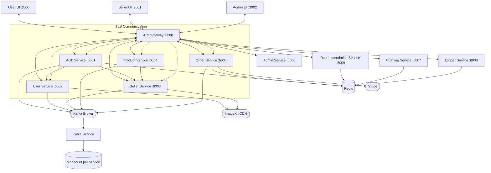

# TecShop

A modern, secure, and scalable multi-vendor e-commerce platform built with a microservices architecture. TecShop demonstrates enterprise-grade patterns including mutual TLS authentication, real-time communication, collaborative filtering recommendations, and event-driven analytics.

## Overview & DEMO

TecShop is a production-ready microservices-based e-commerce platform showcasing modern software architecture principles. The system implements a secure, scalable foundation suitable for enterprise applications with features like JWT authentication, refresh token rotation, social login, Stripe payments, real-time chat, AI-powered product recommendations, and comprehensive admin tooling.

I will add a video demo link later.

## Kanban Project Management Methodology

<!-- Jira board screenshots go here (GitVisuals/) -->

I will add pictures of my agile methodologies later.

## Architecture

### Microservices Design

| Service | Port | Type | Responsibility |
|---|---|---|---|
| **API Gateway** | 8080 | REST | Central entry point, routing, rate limiting, auth guards |
| **Auth Service** | 6001 | TCP | Authentication, JWT, OAuth, OTP, password management |
| **User Service** | 6002 | TCP | User profiles, followers, shipping addresses, image uploads |
| **Seller Service** | 6003 | TCP | Seller accounts, shops, discounts, events, Stripe Connect |
| **Product Service** | 6004 | TCP | Product catalog, categories, brands, variants, ratings |
| **Order Service** | 6005 | TCP | Orders, payments, Stripe Checkout, payouts |
| **Admin Service** | 6006 | TCP | Platform administration, user/seller management |
| **Chatting Service** | 6007 | TCP + WS | Real-time buyer-seller messaging via Socket.IO |
| **Logger Service** | 6008 | TCP + WS | Centralized structured logging and notifications |
| **Recommendation Service** | 6009 | TCP | ML-based product recommendations (collaborative filtering) |
| **Kafka Service** | - | Kafka | Analytics event consumer, user/product/shop metrics |
| **User UI** | 3000 | Next.js | Customer-facing storefront |
| **Seller UI** | 3001 | Next.js | Seller dashboard and shop management |
| **Admin UI** | 3002 | Next.js | Platform administration panel |

### Shared Libraries

| Library | Path | Purpose |
|---|---|---|
| `@tec-shop/dto` | `libs/shared/dto` | Shared DTOs across all services |
| `@tec-shop/validation` | `libs/shared/validation` | Shared validation logic |
| `@tec-shop/interceptor` | `libs/shared/interceptor` | `LoggingInterceptor`, `ErrorInterceptor`, `AllExceptionsFilter` |
| `@tec-shop/service-auth` | `libs/shared/service-auth` | HMAC inter-service request signing (`ServiceAuthUtil`) |
| `@tec-shop/redis-client` | `libs/shared/redis-client` | Shared `RedisModule.forRoot()` and `RedisService` |
| `@tec-shop/kafka-events` | `libs/shared/kafka-events` | Typed Kafka topic constants and event interfaces |
| `@tec-shop/logger-producer` | `libs/shared/logger-producer` | Kafka producer for structured log events |
| `@tec-shop/notification-producer` | `libs/shared/notification-producer` | Kafka producer for notification events |
| `@tec-shop/i18n` | `libs/shared/i18n` | Shared `next-intl` v4 routing config and navigation helpers |
| `@tec-shop/imagekit` | `libs/shared/imagekit` | ImageKit CDN integration |
| `@tec-shop/components` | `libs/shared/components` | Shared UI component primitives |

### Inter-Service Communication

- All backend services communicate via **NestJS TCP microservices**
- Sensitive cross-service calls (profile creation) use **HMAC-signed requests** (`ServiceAuthUtil`)
- Analytics events flow through **Apache Kafka** (producer in each service, consumer in `kafka-service`)
- Real-time features use **Socket.IO** (chatting-service, logger-service notifications)
- **mTLS** certificates available for encrypted service-to-service transport in production

### Security Features

- **Mutual TLS (mTLS)**: Certificate-based service-to-service authentication
- **JWT Authentication**: Stateless access + refresh token rotation with httpOnly cookies
- **HMAC Inter-Service Auth**: `SERVICE_MASTER_SECRET`-derived signatures for cross-service calls
- **Role-Based Access Control**: `ADMIN`, `SELLER`, `CUSTOMER` roles enforced via `RolesGuard`
- **Rate Limiting**: Three-tier throttling (short / medium / long), environment-aware limits
- **Security Headers**: Helmet (CSP, HSTS, XSS protection)
- **Input Validation**: class-validator + class-transformer DTOs
- **Password Security**: bcrypt with configurable salt rounds
- **Token Blacklisting**: Redis-backed refresh token revocation

## Technology Stack

### Backend

- **Framework**: NestJS with TypeScript
- **Database**: MongoDB with Prisma ORM (separate schema and client per service)
- **Caching & Sessions**: Redis (`ioredis`) via `@tec-shop/redis-client`
- **Message Broker**: Apache Kafka for async analytics and notification events
- **Authentication**: JWT with Passport (local + Google OAuth 2.0 strategies)
- **Payments**: Stripe (Checkout Sessions, Connect, webhooks)
- **Real-Time**: Socket.IO for chat and live notifications
- **File Uploads**: ImageKit CDN integration
- **Logging**: Structured logging with `nestjs-pino` + Pino across all services
- **Documentation**: Swagger / OpenAPI at `/api-docs`
- **ML**: Collaborative filtering model for product recommendations

### Frontend

- **Framework**: Next.js 15 with React 19
- **Styling**: Tailwind CSS
- **State Management**: TanStack Query (server state) + Zustand (client state)
- **Forms**: TanStack Form + class-validator
- **Internationalization**: `next-intl` v4 with URL-based locale routing (`/en/`, `/ar/`)
- **UI Components**: Radix UI primitives + Lucide icons
- **Notifications**: Sonner toast messages

### DevOps & Tooling

- **Monorepo**: Nx workspace with module boundary enforcement (ESLint)
- **Testing**: Jest with per-service test suites
- **Linting**: ESLint with TypeScript and NX boundary rules
- **Infrastructure**: Docker multi-stage builds, Kubernetes + Helm chart, Prometheus monitoring
- **Package Management**: npm workspaces

## Key Features

### Authentication & Security

- Email/password registration with OTP email verification
- Google OAuth 2.0 integration
- Remember me functionality with extended sessions
- Password reset with cryptographically secure codes
- Automatic token refresh with rotation
- Session management with httpOnly cookies
- Account ban/unban by admins

### Multi-Vendor Marketplace

- Sellers create and manage shops with branding (logo, banner)
- Admins control the category and brand taxonomy
- Sellers manage products, variants (SKU, price, stock), and images (up to 4 per product)
- Discount codes with configurable type, value, expiry, and usage limits
- Shop events with scheduled start/end dates
- Stripe Connect for seller payouts

### Orders & Payments

- Stripe Checkout Session-based payment flow
- Webhook-driven order status transitions
- Per-seller payout tracking
- Order history with item-level detail

### Real-Time Features

- Buyer-to-seller chat with Socket.IO
- Online presence tracking
- Live notification delivery
- Centralized log streaming to admin dashboard

### Recommendations

- Collaborative filtering model trained on user analytics (views, add-to-cart, purchases)
- Fallback to popularity-based rankings for cold-start users
- Similar product discovery by shop context
- Redis-cached results with background retraining scheduler

### Internationalization

- Full URL-based locale routing (`/en/`, `/ar/`) via `next-intl` v4
- Shared translations in `@tec-shop/i18n`; per-app overrides merged at request time
- Language switcher across all three frontends

## Quick Start

### Prerequisites

- Node.js 18+
- MongoDB instance (or Atlas)
- Redis instance
- Apache Kafka (for analytics events)
- SMTP server (for email OTPs)

### Installation

1. Clone the repository

```bash
git clone <repository-url>
cd tec-shop
```

2. Install dependencies

```bash
npm install
```

3. Set up environment variables

```bash
cp .env.example .env
# Edit .env with your configuration
```

4. Generate Prisma clients

```bash
npm run prisma:generate
```

5. Push database schemas

```bash
npm run prisma:db-push
```

6. Generate mTLS certificates (optional for development)

```bash
./generate-certs.sh --all
```

7. Start all services

```bash
npm run dev
```

The application will be available at:

- API Gateway: http://localhost:8080/api
- API Documentation: http://localhost:8080/api-docs
- User UI: http://localhost:3000
- Seller UI: http://localhost:3001
- Admin UI: http://localhost:3002

## Development Commands

### Service Management

```bash
npm run dev                          # Start all services
npx nx serve <service-name>          # Start specific service
npx nx build <service-name>          # Build specific service
npx nx run-many --target=serve --all # Start all services
```

### Database Operations

```bash
npm run prisma:generate  # Generate all Prisma clients
npm run prisma:db-push   # Push schema changes to database
npm run prisma:studio    # Open Prisma Studio
```

### Certificate Management

```bash
./generate-certs.sh --all                      # Generate all certificates
./generate-certs.sh --service <service-name>   # Generate for specific service
./generate-certs.sh --clean                    # Remove all certificates
```

### Testing & Quality

```bash
npx nx test <service>                    # Run tests for specific service
npx nx lint <service>                    # Lint specific service
npx nx typecheck <service>               # Type check specific service
npx nx run-many --target=test --all      # Run all tests
```

## Environment Variables

### Required Variables

```bash
# Database — one URL per service (separate MongoDB databases)
AUTH_SERVICE_DB_URL="mongodb://localhost:27017/auth"
USER_SERVICE_DB_URL="mongodb://localhost:27017/user"
SELLER_SERVICE_DB_URL="mongodb://localhost:27017/seller"
PRODUCT_SERVICE_DB_URL="mongodb://localhost:27017/product"
ORDER_SERVICE_DB_URL="mongodb://localhost:27017/order"
ANALYTICS_SERVICE_DB_URL="mongodb://localhost:27017/analytics"
CHATTING_SERVICE_DB_URL="mongodb://localhost:27017/chatting"
LOGGER_SERVICE_DB_URL="mongodb://localhost:27017/logger"

# Redis
REDIS_URL="redis://localhost:6379"

# Security (minimum 32 characters, no defaults allowed)
JWT_SECRET="your-jwt-secret-minimum-32-characters"
SERVICE_MASTER_SECRET="your-service-master-secret-32-chars"

# Email
SMTP_HOST="smtp.example.com"
SMTP_PORT=587
SMTP_USER="your-smtp-user"
SMTP_PASS="your-smtp-password"
SMTP_FROM="noreply@yourdomain.com"

# Google OAuth (optional)
GOOGLE_CLIENT_ID="your-google-client-id"
GOOGLE_CLIENT_SECRET="your-google-client-secret"
GOOGLE_CALLBACK_URL="http://localhost:8080/api/auth/google/callback"

# Stripe
STRIPE_SECRET_KEY="sk_test_..."
STRIPE_WEBHOOK_SECRET="whsec_..."

# ImageKit CDN
IMAGEKIT_URL_ENDPOINT="https://ik.imagekit.io/your-id"
IMAGEKIT_PUBLIC_KEY="your-imagekit-public-key"
IMAGEKIT_PRIVATE_KEY="your-imagekit-private-key"

# Kafka
KAFKA_BROKER="localhost:9092"

# Service Hosts (defaults to localhost in development)
AUTH_SERVICE_HOST=localhost
AUTH_SERVICE_PORT=6001
USER_SERVICE_HOST=localhost
USER_SERVICE_PORT=6002
SELLER_SERVICE_HOST=localhost
SELLER_SERVICE_PORT=6003
PRODUCT_SERVICE_HOST=localhost
PRODUCT_SERVICE_PORT=6004
ORDER_SERVICE_HOST=localhost
ORDER_SERVICE_PORT=6005
```

### Production Configuration

For production deployment, use the `.env.production.example` template with:

- Strong, unique secrets for JWT and `SERVICE_MASTER_SECRET`
- Production database URLs with connection pooling
- Production SMTP credentials
- Secured Redis with authentication and persistence
- HTTPS URLs for all external services and OAuth callbacks

## API Documentation

The API is fully documented with Swagger/OpenAPI. Access the interactive documentation at:

- Development: http://localhost:8080/api-docs
- Production: https://your-domain.com/api-docs

### Core Endpoint Groups

| Group | Base Path | Auth Required |
|---|---|---|
| Authentication | `/api/auth` | Varies |
| User Profiles | `/api/user` | JWT |
| Sellers | `/api/seller` | JWT + SELLER |
| Shops | `/api/shops` | Varies |
| Products | `/api/products` | Varies |
| Categories | `/api/categories` | Admin write |
| Brands | `/api/brands` | Admin write |
| Orders | `/api/orders` | JWT |
| Admin | `/api/admin` | JWT + ADMIN |
| Chat | `/api/chat` | JWT |
| Recommendations | `/api/recommendations` | JWT |
| Webhooks | `/api/webhooks/stripe` | Stripe signature |

## Architecture Diagram


```mermaid
graph TB
    UserUI[User UI :3000]
    SellerUI[Seller UI :3001]
    AdminUI[Admin UI :3002]
    GW[API Gateway :8080]

    Auth[Auth Service :6001]
    User[User Service :6002]
    Seller[Seller Service :6003]
    Product[Product Service :6004]
    Order[Order Service :6005]
    Admin[Admin Service :6006]
    Chat[Chatting Service :6007]
    Logger[Logger Service :6008]
    Rec[Recommendation Service :6009]
    Kafka[Kafka Service]

    MongoDB[(MongoDB per service)]
    Redis[(Redis)]
    KafkaBroker([Kafka Broker])
    Stripe([Stripe])
    ImageKit([ImageKit CDN])

    UserUI <--> GW
    SellerUI <--> GW
    AdminUI <--> GW

    GW <--> Auth
    GW <--> User
    GW <--> Seller
    GW <--> Product
    GW <--> Order
    GW <--> Admin
    GW <--> Chat
    GW <--> Logger
    GW <--> Rec

    Auth --> User
    Auth --> Seller
    Product --> Seller
    Order --> Stripe

    Auth & User & Seller & Product & Order --> KafkaBroker
    KafkaBroker --> Kafka
    Kafka --> MongoDB

    Auth & Order & Rec --> Redis
    Chat & Logger --> Redis

    User & Seller --> ImageKit

    subgraph "mTLS Communication"
        GW -.-> Auth & User & Seller & Product & Order
    end
```

## Security Considerations

### Authentication Flow

1. User registers with email/password
2. 6-digit OTP sent via email for verification (3-attempt limit, Redis-backed)
3. Verified user receives JWT access token and refresh token in httpOnly cookies
4. Access token: 1 hour (standard) or 24 hours (remember me)
5. Refresh token: 7 days (standard) or 30 days (remember me)
6. Silent token refresh on expiry with rotation
7. Logout revokes the refresh token in the database

### Rate Limiting Tiers

| Tier | Endpoints | Dev Limit | Prod Limit |
|---|---|---|---|
| Short | General | 1000 req/min | 100 req/min |
| Medium | Auth operations | 100 req/15min | 20 req/15min |
| Long | Search / high-frequency | 2000 req/min | 200 req/min |

### Data Protection

- Passwords hashed with bcrypt (10 rounds)
- Refresh tokens hashed with SHA-256 before storage
- Sensitive data encrypted in transit (HTTPS/TLS)
- Input validation on all endpoints via class-validator DTOs
- No SQL injection risk — Prisma ORM with MongoDB

## Deployment

### Docker

Multi-stage Dockerfiles for all services are in `infrastructure/docker/services/`.

```bash
docker-compose up -d
```

### Kubernetes / Helm

Helm chart and per-environment values files are in `infrastructure/helm/tec-shop/`.

```bash
# Deploy
./infrastructure/scripts/deploy.sh

# Rollback
./infrastructure/scripts/rollback.sh
```

### Production Checklist

- [ ] Set strong, unique environment variables (no defaults)
- [ ] Configure production databases with connection pooling
- [ ] Set up Redis with persistence and authentication
- [ ] Configure HTTPS with valid SSL certificates
- [ ] Generate mTLS certificates for all services
- [ ] Set up Kafka with topic replication
- [ ] Configure Stripe webhook endpoint and secret
- [ ] Set up ImageKit project and keys
- [ ] Enable Prometheus metrics scraping (`:3000/metrics`)
- [ ] Configure reverse proxy (nginx)
- [ ] Enable database backups
- [ ] Set up monitoring and alerting

## Troubleshooting

### Common Issues

**Services not starting**

- Check that required ports are available (8080, 6001–6009)
- Verify all environment variables are set (services fail-secure on missing secrets)
- Ensure MongoDB, Redis, and Kafka are running

**Authentication issues**

- Verify `JWT_SECRET` is at least 32 characters
- Verify `SERVICE_MASTER_SECRET` is set for inter-service calls
- Check database connections
- Confirm SMTP configuration for OTP delivery

**mTLS certificate errors**

- Regenerate: `./generate-certs.sh --clean && ./generate-certs.sh --all`
- Ensure certificate file permissions are correct (readable by the service process)

**Kafka events not processing**

- Confirm `KAFKA_BROKER` points to a reachable broker
- Check that the `kafka-service` consumer is running
- Verify topic names match `KafkaTopics` constants in `@tec-shop/kafka-events`

## Acknowledgements

- [Sakura dev](https://www.youtube.com/@SakuraDev) - Comprehensive NestJS microservices guidance and architecture patterns
- NestJS community for excellent documentation and examples
- Prisma team for outstanding ORM and database tooling
- Next.js team for the powerful React framework

## License

[MIT](https://choosealicense.com/licenses/mit/)
